```mermaid
flowchart LR
    Raw[Raw Agentforce Response] --> Parser[richResponseParser]
    Parser --> Speech[Speech Text]
    Parser --> Visuals[Visual Commands]
    Speech --> HeyGen[TTS → Avatar]
    Visuals --> VisualStore[visualOverlayStore]
    VisualStore --> VisualOverlay
    VisualStore --> AvatarOverlay
```

# CKO Miguel Avatar - Architecture Overview

Full-stack interactive AI avatar platform integrating **HeyGen** (avatar + TTS), **Salesforce Agentforce** (conversational AI), and **Deepgram/ElevenLabs** (speech-to-text).

## Architecture Diagrams

**Full system architecture:**


**Video & overlay system:**


---

## High-Level Architecture

```mermaid
flowchart TB
    subgraph Browser["🖥️ Browser (React)"]
        UI[Pages & Components]
        Hooks[Hooks - Orchestration]
        Stores[Zustand Stores]
        UI --> Hooks --> Stores
    end

    subgraph Server["⚙️ Express Server (Heroku)"]
        API[API Routes]
        SF[Salesforce Auth]
        API --> SF
    end

    subgraph External["☁️ External Services"]
        HeyGen[HeyGen Streaming API]
        Agentforce[Salesforce Agentforce]
        Deepgram[Deepgram STT]
        ElevenLabs[ElevenLabs TTS/STT]
    end

    Browser -->|/api/*| Server
    Server --> Agentforce
    Server --> HeyGen
    Browser -->|WebSocket/Streaming| Deepgram
    Browser -->|WebRTC/TTS| HeyGen
    Browser -->|fallback TTS| ElevenLabs
```



---

## End-to-End Conversation Flow


---

## Component Stack


---

## Key Directories

| Layer | Path | Purpose |
|-------|------|---------|
| **Pages** | `src/pages/` | KeynoteAvatar, PitchAvatar, Proto variants, LogViewer |
| **Orchestration** | `src/hooks/` | useAvatarConversation, useScopedAvatarConversation, useDeepgramStreaming |
| **API Client** | `src/services/api.ts` | All `/api/*` calls to Express backend |
| **Avatar** | `src/components/Avatar/` | HologramAvatar (HeyGen display) + AvatarOverlay |
| **Overlays** | `src/components/Overlay/` | VisualOverlay, AvatarOverlay, SlideOverlay, ScoreOverlay, CountdownOverlay, VideoCallEscalationOverlay, QuizOverlay |
| **Parser** | `src/lib/` | richResponseParser, structuredResponseParser, hardcodedTriggers |
| **State** | `src/stores/` | conversationStore, visualOverlayStore, settingsStore |
| **Server** | `server/` | Express + routes for Agentforce, HeyGen, Deepgram |

---

## Server API Routes

| Route | Purpose |
|-------|---------|
| `POST /api/agentforce-session` | Start/end Agentforce sessions |
| `POST /api/agentforce-message` | Send message, stream SSE response |
| `POST /api/heygen-token` | Get HeyGen streaming token |
| `POST /api/heygen-proxy` | Proxy TTS to HeyGen |
| `POST /api/deepgram-token` | Get Deepgram token |
| `POST /api/deepgram-transcribe` | Transcribe audio (pre-recorded) |
| `POST /api/elevenlabs-tts` | ElevenLabs TTS fallback |
| `POST /api/elevenlabs-scribe-token` | ElevenLabs STT token |
| `GET/POST /api/leaderboard` | Quiz leaderboard (Supabase) |
| `POST /api/conversation-log` | Persist conversation events |
| `WS /ws/logs` | Real-time debug log streaming |

---

## Video & Visual Overlay System

The app has a layered overlay system for images, videos, slides, scores, and quiz UI. Overlays can be triggered by:

1. **Agentforce rich response** – `<visual>` tags in streamed text
2. **Agentforce structured JSON** – `actions` array with `showVisual`, `slide`, `score`, etc.
3. **Hardcoded triggers** – Easter eggs (backflip, dance, superpower, dream) bypass Agentforce

### Overlay Components

| Component | Store | Purpose | Trigger |
|-----------|-------|---------|---------|
| **VisualOverlay** | `visualOverlayStore` | Images/videos (positions: center, top, left, etc.) | `<visual>` tags, `showVisual` action |
| **AvatarOverlay** | `visualOverlayStore` | Fullscreen video/image over avatar (`position: avatar`) | Hardcoded triggers, `<visual position="avatar">` |
| **SlideOverlay** | `slideOverlayStore` | Slide deck pages (`/slides/page_N.jpg`) | `slide` action, `{ page: 4 }` |
| **ScoreOverlay** | `scoreOverlayStore` | Score display (0–100) | `score` action, `{ value: 95 }` |
| **CountdownOverlay** | `countdownStore` | Countdown timer | `countdown` action, `{ seconds: 60 }` |
| **QuizOverlay** | `quizOverlayStore` | Name entry, leaderboard | `showNameEntry`, `showLeaderboard` |
| **VideoCallEscalationOverlay** | `videoCallEscalationStore` | Video call simulation | `customOverlay: 'video-call-escalation'` (hardcoded) |

### Overlay Flow Diagram


### Visual Tag Syntax (Agentforce)

```
<visual type="image|gif|video" src="URL" duration="5000" position="center" />
```

| Attribute | Values | Description |
|-----------|--------|-------------|
| `type` | `image`, `gif`, `video` | Media type (default: `image`) |
| `src` | URL | Media source |
| `duration` | `5000`, `5s`, `500ms` | Display time in ms |
| `position` | `center`, `top`, `bottom`, `left`, `right`, `topleft`, `topright`, `bottomleft`, `bottomright`, `avatar` | Placement. `avatar` = fullscreen over avatar (seamless blend) |
| `startOffset` | ms | Delay before showing (optional) |

- **`position: avatar`** → Rendered by **AvatarOverlay** inside `HologramAvatar` for seamless video overlay
- **Other positions** → Rendered by **VisualOverlay** with max 80vw/80vh, rounded corners

### Structured Action Types (Agentforce JSON)

| Action | Data | Effect |
|--------|------|--------|
| `showVisual` | `{ src, type?, position?, duration? }` | Queue image/video overlay |
| `slide` | `{ page: 4 }` | Show slide 4 (`/slides/page_4.jpg`) |
| `hideSlide` | — | Hide slide overlay |
| `score` | `{ value: 95 }` | Show score overlay (Pitch only) |
| `hideScore` | — | Hide score overlay |
| `countdown` | `{ seconds: 60 }` | Start countdown timer |
| `stopCountdown` | — | Stop countdown |
| `showNameEntry` | `{ firstName, lastName, country, score }` | Open quiz name entry form |
| `showLeaderboard` | — | Open leaderboard overlay |
| `hideOverlay` | — | Close quiz overlay |
| `setLeaderboardData` | `{ entries, userRank?, userEntry? }` | Populate leaderboard |
| `prefillData` | `{ firstName, lastName, country, score }` | Prefill forms |

### Hardcoded Triggers (Easter Eggs)

Bypass Agentforce for specific keywords – trigger **AvatarOverlay** with `position: avatar`:

| Keyword | Video | Duration |
|---------|-------|----------|
| backflip, salto | `Miguel_Backflip.mp4` | 5s |
| superpower | `Miguel_Net_New_AOV.mp4` | 10s |
| dance, dancing | `Miguel_Dancing_New.mp4` | 15s |
| dream, dreaming | `Miguel_Gong.mp4` | 10s |

Defined in `src/lib/hardcodedTriggers.ts`. Videos preloaded on page load.

### Overlay Layering (z-index)

| Layer | z-index | Component |
|-------|---------|-----------|
| Base avatar | — | HologramAvatar |
| Avatar overlay (video on avatar) | 5 | AvatarOverlay (inside avatar) |
| Visual/slide/score | 40 | VisualOverlay, SlideOverlay, ScoreOverlay |
| Video call escalation | 50 | VideoCallEscalationOverlay |
| Quiz modals | higher | QuizOverlayManager |

---

## Rich Response Flow

Agentforce can return text with embedded tags:

```
"Here's our product <visual type="image" src="..." duration="5000"/> - enjoy!"
```



---

## Deployment (Heroku)

```
                    ┌─────────────────────────────┐
                    │     cko-miguel-avatar       │
                    │  (Node.js + React build)    │
                    ├─────────────────────────────┤
                    │  Static: /dist (React)      │
                    │  API:   /api/*              │
                    │  WS:    /ws/logs            │
                    └──────────────┬──────────────┘
                                   │
            ┌──────────────────────┼──────────────────────┐
            ▼                      ▼                      ▼
    ┌───────────────┐    ┌─────────────────┐    ┌────────────────┐
    │ Salesforce    │    │ HeyGen API      │    │ Deepgram API   │
    │ Agentforce    │    │ (token, TTS)    │    │ (STT)          │
    └───────────────┘    └─────────────────┘    └────────────────┘
```

**Env vars:** `SALESFORCE_*`, `HEYGEN_API_KEY`, `DEEPGRAM_API_KEY`, `ELEVENLABS_API_KEY`, `DATABASE_URL` (Postgres for conversation_logs).
